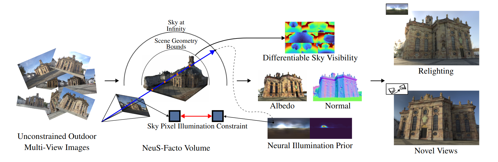

# The Sky’s the Limit

### Official implementation of NeuSky.

Paper: The Sky's the Limit: Re-lightable Outdoor Scenes via a Sky-pixel Constrained Illumination Prior and Outside-In Visibility



## Installation

We build on top of Nerfstudio. However, since Nerfstudio is still in very active development with fairly large codebase changes still occurring compatibility might be an issue. Pull requests and issues are very welcome.

### Prerequisites

You must have an NVIDIA video card with CUDA installed on the system. This library has been tested with version 11.8 of CUDA. You can find more information about installing CUDA [here](https://docs.nvidia.com/cuda/cuda-quick-start-guide/index.html)

### Create Environment

Nerfstudio requires `python >= 3.8`. We recommend using conda to manage dependencies. Make sure to install [Conda](https://docs.conda.io/miniconda.html) before proceeding.

#### Install nerfstudio

```bash
conda create --name nerfstudio -y python=3.8

conda activate nerfstudio

pip install --upgrade pip

pip install torch==2.0.1+cu118 torchvision==0.15.2+cu118 --extra-index-url https://download.pytorch.org/whl/cu118

conda install -c "nvidia/label/cuda-11.8.0" cuda-toolkit

pip install ninja git+https://github.com/NVlabs/tiny-cuda-nn/#subdirectory=bindings/torch

git clone https://github.com/nerfstudio-project/nerfstudio.git

cd nerfstudio

pip install --upgrade pip setuptools

pip install -e .
```

#### Install NeuSky

a. Clone repo and install RENI++

```bash
git clone --recurse-submodules https://github.com/JADGardner/neusky.git

sudo apt install libopenexr-dev

conda install -c conda-forge openexr

cd neusky/ns_reni

pip install -e .
```

b. Install NeuSky

```bash
cd ..

pip install -e .
```

c. Setup Nerfstudio CLI

```bash
ns-install-cli
```

d. Close and reopen your terminal and source conda environment again:

```bash
conda activate nerfstudio
```

## Download Data

```bash
ns-download-data nerfosr --save-dir data --capture-name lk2
```

```bash
python neusky/scripts/download_and_copy_segmentation_masks.py lk2 /path/to/Data/NeRF-OSR
```

## Start Training

You can now launch training for scene 'lk2'

```bash
ns-train neusky --vis wandb
```

If you find you run out of GPU memory you can try updating some or all of these settings in

```bash
neusky/neusky/configs/neusky_config.py
```

```bash
train_num_images_to_sample_from=-1, # Set to integer value if out of GPU memory
train_num_times_to_repeat_images=-1, # Iterations before resampling a new subset, set to integer value if out of GPU memory
images_on_gpu=True, # set False if out of GPU memory
masks_on_gpu=True, # set False if out of GPU memory
train_num_rays_per_batch=1024, # Lower to 512, 256, or 128 if out of GPU memory
eval_num_rays_per_batch=1024, # Lower to 512, 256, or 128 if out of GPU memory
```
