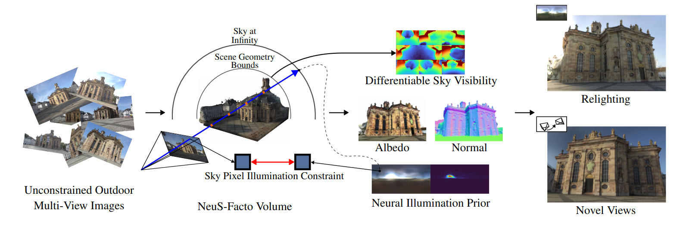

# The Sky's the Limit

### Official implementation of NeuSky.

Paper: The Sky's the Limit: Relightable Outdoor Scenes via a Sky-pixel Constrained Illumination Prior and Outside-In Visibility



## Installation

NeuSky is a [nerfstudio](https://github.com/nerfstudio-project/nerfstudio) extension for outdoor neural scene reconstruction with sky-pixel constrained illumination priors. It depends on:

- **nerfstudio** (mainline, from source)
- **ns_reni** (RENI++ illumination fields, included as a git submodule)
- **tiny-cuda-nn** (hash grid encodings)
- **nvdiffrast** (differentiable rasterization)
- **COLMAP** (Structure-from-Motion)

### Prerequisites

- NVIDIA GPU with CUDA 12.x support
- [Docker](https://docs.docker.com/engine/install/) + [NVIDIA Container Toolkit](https://docs.nvidia.com/datacenter/cloud-native/container-toolkit/), OR
- [Apptainer](https://apptainer.org/) (for HPC clusters)

### Clone with submodules

```bash
git clone --recurse-submodules https://github.com/JADGardner/neusky.git
cd neusky
```

---

## Option A: Docker (local machines)

### 1. Set up data and model directories

NeuSky requires datasets, pretrained RENI++ checkpoints, and an output directory. Either create symlinks in the project root:

```bash
ln -s /path/to/datasets data
ln -s /path/to/pretrained-models model-storage
mkdir -p outputs
```

Or set environment variables (in your shell or a `.env` file in the project root):

```bash
# .env
DATA_PATH=/path/to/datasets
MODEL_STORAGE_PATH=/path/to/pretrained-models
OUTPUTS_PATH=/path/to/outputs
```

**RENI++ checkpoints (required):** NeuSky uses RENI++ as its illumination prior. Set `RENI_CKPT_PATH` to the directory containing the pretrained RENI++ models (the `checkpoints/reni_plus_plus_models/` directory from ns_reni):

```bash
export RENI_CKPT_PATH=/path/to/ns_reni/checkpoints/reni_plus_plus_models
```

This gets mounted at `/workspace/model-storage/reni_plus_plus` inside the container.

### 2. Build and run

```bash
# Build the image (compiles CUDA extensions — takes 20-40 min first time)
docker compose build research

# Start an interactive shell
docker compose run research bash

# Or train directly
docker compose run research ns-train neusky --data /workspace/data/NeRF-OSR/Data/lk2
```

Inside the container, the project is mounted at `/workspace` with:
- `/workspace/data` -- datasets (NeRF-OSR at `data/NeRF-OSR/Data/`)
- `/workspace/outputs` -- training outputs
- `/workspace/model-storage` -- pretrained checkpoints
- `/workspace/model-storage/reni_plus_plus` -- RENI++ checkpoints

The entrypoint automatically installs `neusky` and `ns_reni` (submodule at `ns_reni/`) editably.

---

## Option B: Apptainer (HPC clusters)

See the `.apptainer/` directory for HPC/SLURM setup.

```bash
cp .apptainer/.env.example .apptainer/.env
# Edit .apptainer/.env with your cluster paths
```

```bash
# Build the SIF (submit as a build job — needs ~64GB RAM, ~3 hours)
.apptainer/apptainer.sh build

# Register local project packages (one-time)
.apptainer/apptainer.sh install

# Interactive shell
.apptainer/apptainer.sh shell

# Run a command
.apptainer/apptainer.sh exec -- ns-train neusky --vis wandb

# Verify the container
.apptainer/apptainer.sh exec -- python .apptainer/test_container.py
```

---

## Option C: Manual installation (conda)

For development without containers.

```bash
conda create -n neusky python=3.12 -y
conda activate neusky
conda install -c conda-forge colmap -y

pip install torch torchvision torchaudio --extra-index-url https://download.pytorch.org/whl/cu128

# CUDA extensions
pip install --no-build-isolation git+https://github.com/NVlabs/tiny-cuda-nn.git#subdirectory=bindings/torch
pip install --no-build-isolation git+https://github.com/NVlabs/nvdiffrast.git

# nerfstudio
git clone --depth 1 https://github.com/nerfstudio-project/nerfstudio.git
pip install -e nerfstudio

# ns_reni (submodule)
pip install -e ns_reni

# NeuSky
pip install -e .

ns-install-cli
```

---

## Download RENI++ pre-trained models

```bash
python ns_reni/scripts/download_models.py output/path/for/reni_plus_plus_models/
```

Then update the config for NeuSky to point to the chosen RENI++ directory:

https://github.com/JADGardner/neusky/blob/bdf689b8b23a9fc38144e789686edcb161b512e7/neusky/configs/neusky_config.py#L150

## Download Data

```bash
ns-download-data nerfosr --save-dir data --capture-name lk2
```

```bash
python neusky/scripts/download_and_copy_segmentation_masks.py lk2 /path/to/Data/NeRF-OSR
```

## Start Training

```bash
ns-train neusky --vis wandb
```

If you run out of GPU memory, try updating some or all of these settings in `neusky/configs/neusky_config.py`:

```python
train_num_images_to_sample_from=-1,   # Set to integer value if out of GPU memory
train_num_times_to_repeat_images=-1,  # Iterations before resampling a new subset
images_on_gpu=True,                   # set False if out of GPU memory
masks_on_gpu=True,                    # set False if out of GPU memory
train_num_rays_per_batch=1024,        # Lower to 512, 256, or 128 if out of GPU memory
eval_num_rays_per_batch=1024,         # Lower to 512, 256, or 128 if out of GPU memory
```
