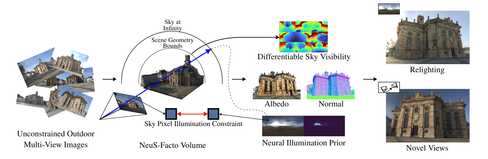

# The Sky's the Limit

### Official implementation of NeuSky.

Paper: The Sky's the Limit: Relightable Outdoor Scenes via a Sky-pixel Constrained Illumination Prior and Outside-In Visibility



## Installation

NeuSky is a [nerfstudio](https://github.com/nerfstudio-project/nerfstudio) extension for outdoor neural scene reconstruction with sky-pixel constrained illumination priors. It depends on:

- **nerfstudio** (mainline, from source)
- **ns_reni** (RENI++ illumination fields, included as a git submodule)
- **tiny-cuda-nn** (hash grid encodings)
- **nvdiffrast** (differentiable rasterization)
- **COLMAP** (Structure-from-Motion)

### Prerequisites

- NVIDIA GPU with CUDA 12.x support
- [Docker](https://docs.docker.com/engine/install/) + [NVIDIA Container Toolkit](https://docs.nvidia.com/datacenter/cloud-native/container-toolkit/), OR
- [Apptainer](https://apptainer.org/) (for HPC clusters)

### Clone with submodules

```bash
git clone --recurse-submodules https://github.com/JADGardner/neusky.git
cd neusky
```

---

## Option A: Docker (local machines)

### 1. Set up data and model directories

NeuSky requires datasets, pretrained RENI++ checkpoints, and an output directory. Either create symlinks in the project root:

```bash
ln -s /path/to/datasets data
ln -s /path/to/pretrained-models model-storage
mkdir -p outputs
```

Or set environment variables (in your shell or a `.env` file in the project root):

```bash
# .env
DATA_PATH=/path/to/datasets
MODEL_STORAGE_PATH=/path/to/pretrained-models
OUTPUTS_PATH=/path/to/outputs
```

**RENI++ checkpoint (required):** NeuSky uses the released channelwise,
two-bracket RENI prior. Download that exact prior into the model-storage
layout expected by the checked-in configs:

```bash
python ns_reni/scripts/download_models.py \
  model-storage/reni \
  --group neusky-prior
```

This is the prior used to train the released NeuSky models. It is distinct
from the later joint-frame RENI thesis model.

### 2. Build and run

```bash
# Build the image (compiles CUDA extensions — takes 20-40 min first time)
docker compose build research

# Start an interactive shell
docker compose run research bash

# Or train directly
docker compose run research ns-train neusky --data /workspace/data/NeRF-OSR/Data/lk2
```

Inside the container, the project is mounted at `/workspace` with:
- `/workspace/data` -- datasets (NeRF-OSR at `data/NeRF-OSR/Data/`)
- `/workspace/outputs` -- training outputs
- `/workspace/model-storage` -- pretrained checkpoints
- `/workspace/model-storage/reni/neusky-prior` -- NeuSky's RENI prior

The entrypoint automatically installs `neusky` and `ns_reni` (submodule at `ns_reni/`) editably.

---

## Option B: Apptainer (HPC clusters)

See the `.apptainer/` directory for HPC/SLURM setup.

```bash
cp .apptainer/.env.example .apptainer/.env
# Edit .apptainer/.env with your cluster paths
```

```bash
# Build the SIF (submit as a build job — needs ~64GB RAM, ~3 hours)
.apptainer/apptainer.sh build

# Register local project packages (one-time)
.apptainer/apptainer.sh install

# Interactive shell
.apptainer/apptainer.sh shell

# Run a command
.apptainer/apptainer.sh exec -- ns-train neusky --vis wandb

# Verify the container
.apptainer/apptainer.sh exec -- python .apptainer/test_container.py
```

---

## Option C: Manual installation (conda)

For development without containers.

```bash
conda create -n neusky python=3.12 -y
conda activate neusky
conda install -c conda-forge colmap -y

pip install torch torchvision torchaudio --extra-index-url https://download.pytorch.org/whl/cu128

# CUDA extensions
pip install --no-build-isolation git+https://github.com/NVlabs/tiny-cuda-nn.git#subdirectory=bindings/torch
pip install --no-build-isolation git+https://github.com/NVlabs/nvdiffrast.git

# nerfstudio
git clone --depth 1 https://github.com/nerfstudio-project/nerfstudio.git
pip install -e nerfstudio

# ns_reni (submodule)
pip install -e ns_reni

# NeuSky
pip install -e .

ns-install-cli
```

---

## Download Pretrained Models

Download the required RENI prior and all three final NeRF-OSR NeuSky models:

```bash
python ns_reni/scripts/download_models.py \
  model-storage/reni \
  --group neusky-prior
python scripts/download_models.py model-storage/neusky
```

The NeuSky downloader reads the tagged
[NeuSky Models v1.0 release](https://huggingface.co/jadgardner/neusky-models),
supports resumable downloads, and verifies each file against the release
manifest. Fetch one real scene or the five accepted synthetic models with:

```bash
python scripts/download_models.py model-storage/neusky --scene lk2
python scripts/download_models.py model-storage/neusky --collection synthetic
```

Use `python scripts/download_models.py --list` for all model identifiers.
The figure scripts automatically prefer released models under
`model-storage/neusky`; `NEUSKY_RUNS` can still pin another run explicitly.

## Download Data

### NeRF-OSR

```bash
ns-download-data nerfosr --save-dir data --capture-name lk2
```

Download the NeuSky additions for all three evaluated scenes, verify the
release, and extract them over the directory containing the official `Data/`
folder:

```bash
hf download jadgardner/neusky-nerfosr-overlay \
  --repo-type dataset \
  --revision v1.0 \
  --local-dir neusky-nerfosr-overlay

(cd neusky-nerfosr-overlay && sha256sum -c SHA256SUMS)
for archive in neusky-nerfosr-overlay/archives/*.tar.zst; do
  tar --zstd -xf "$archive" -C /path/to/NeRF-OSR
done
```

The overlay contains only the Cityscapes segmentation masks,
`points3d.ply`, and `envmap_rotations.json` used by NeuSky. It does not
redistribute the original NeRF-OSR images, poses or environment maps.

### Synthetic Benchmark

The five accepted synthetic scene datasets are available as independently
downloadable archives in
[NeuSky Synthetic v1.0](https://huggingface.co/datasets/jadgardner/neusky-synthetic):

```bash
hf download jadgardner/neusky-synthetic \
  --repo-type dataset \
  --revision v1.0 \
  --local-dir neusky-synthetic

(cd neusky-synthetic && sha256sum -c SHA256SUMS)
for archive in neusky-synthetic/archives/*.tar.zst; do
  tar --zstd -xf "$archive" -C data
done
```

The dataset page documents the Blender scene sources, HDRI list, rendering
code and the small accepted Poly Haven source-revision differences.

## Start Training

```bash
ns-train neusky --vis wandb
```

If you run out of GPU memory, try updating some or all of these settings in `neusky/configs/neusky_config.py`:

```python
train_num_images_to_sample_from=-1,   # Set to integer value if out of GPU memory
train_num_times_to_repeat_images=-1,  # Iterations before resampling a new subset
images_on_gpu=True,                   # set False if out of GPU memory
masks_on_gpu=True,                    # set False if out of GPU memory
train_num_rays_per_batch=1024,        # Lower to 512, 256, or 128 if out of GPU memory
eval_num_rays_per_batch=1024,         # Lower to 512, 256, or 128 if out of GPU memory
```
